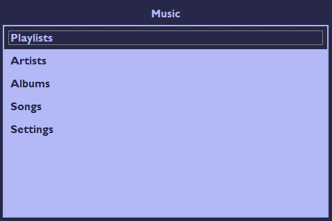
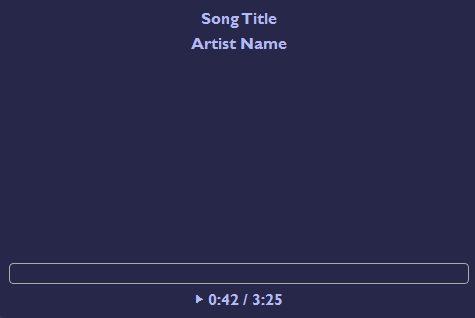

# 💿  DAP_RP

## 📀 About This Project

This is a personal project of Emil Dohne & Vera Großkop. This Digital Audio Player Software will run on our custom Raspberry Pi Audio Player. 
The repository is still a work in process. Below you can find some implemented features and previews:

- Basic UI with different colour schemes.
- Database implementation with SQLAlchemy.
- Personal Usage Data and Statistics.
- Future Feature: Personalized Playlists with AI
- Future Feature: Spotify Accessibility

 

## 📀 Feature Implementation overview 

Full list of prioritized features. We are currently working on the ones with the  🔧.

📂 Music Library
   2.  [ ] Sync library from PC. 
   3.  [ ] 🔧 Complete Database with: 
         * Album, Artist, Album Image, Track, Track Info, Album Info, Genre

🎨 UI
   3. [ ]  🔧 functioning player UI (play, pause, next, previous)
   4. [ ]  🔧 library menu
   5. [ ] customization menu

📊 Collect Data
1. [ ] track playtimes per song
   2. [ ] keep data on sync changes
3. [ ] automated playlist ( Top 100 songs of all time, Top 50 songs this month, yearly playlists)

🔩 Hardware
1. [ ] Set Keybindings on Raspberry Pie to click wheel input (Ipod Classic Style)
2. [ ] Smooth audio transmission to headphones on Raspberry Pi.

## 📀 Hardware Specs

We are stsill troubleshooting some parts, but so far we are using:
- Raspberry Pi Sero 2 W
- 3,5" Touch Display for Raspberry Pi from BerryBase

## 📀 Install instructions

To set up and install the venv (including dev tools), copy and paste the 
following into your command line that was previously `cd`'d to the root 
of this repository.
```
py -m venv .venv
.venv\Scripts\Activate.ps1
pip install -e .[dev]
```

Once that is done, modify the default interpreter of your IDE to point
to the venv
