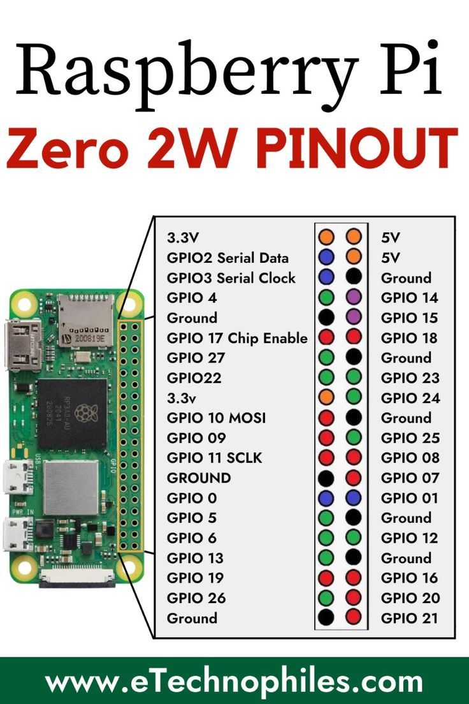

# Developer Notes

## Installation / Driver links

### Screen
Model: 
**BERRYBASE 3,5" Display for Raspberry Pi With Touchscreen (320x480)**

* https://www.waveshare.com/wiki/3.5inch_RPi_LCD_(B)

### Raspberry Pi Sero 2 W
* Headless configuration of a Raspberry Pi using USB Ethernet Gadget on Bookworm
  * https://forums.raspberrypi.com/viewtopic.php?t=376578
  

### Tutorials / Guides / Info
* How to set up automatic deployment via github on raspberry pi
  * https://pabluc.medium.com/raspberrypi-github-actions-ci-cd-1dc098b4c7d3