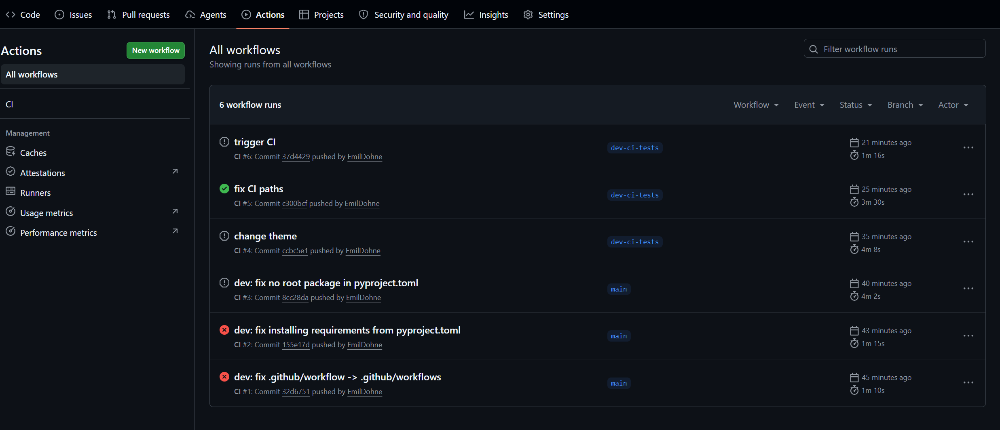

# Overview

This is a top level overview of all the steps needed to get up and running with our raspberry pi zero 2w

## Setting up the raspberry pi zero 2w

- Use Raspberry Pi Imager to flash the OS onto a sd card. Make sure ssh is enabled
- [SSH into the raspberry pi](ssh.md)
- [Set up the display driver](display_setup.md)


## Running python projects

- [SSH into the raspberry pi](ssh.md)
- [Cloning your repository](cloning.md)
- [Creating a venv](venv.md)
- [(Optional) Setting up Qt](qt.md)

## CI/Automation

We also have automatic pushes for the raspberry pi using a self-hosted runner.
For instructions on how to set it up so you only need to push see here:

- [SSH into the raspberry pi](ssh.md)
- [Start github runner](github_runner.md)

This will then start a github action that can be inspected here
after which you should see the raspberry pi display the updated code.



Once you're done with testing you can kill the script using e.g.

```bash
pkill -f python3
```

or by cancelling the job on the github actions tab.

> [!NOTE]
> Since the frame buffer doesn't clear on exit the application will 
> seemingly still run but not be responsive. This is expected and normal.